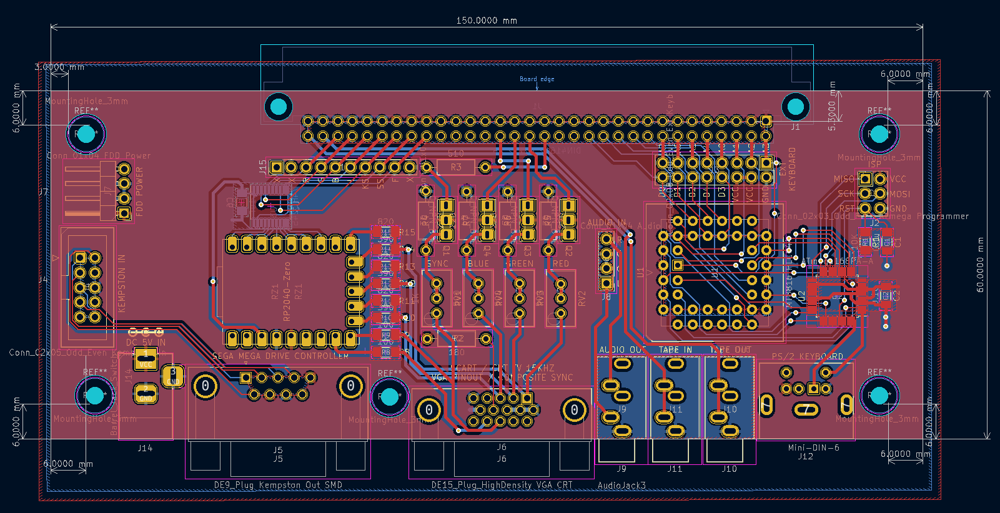
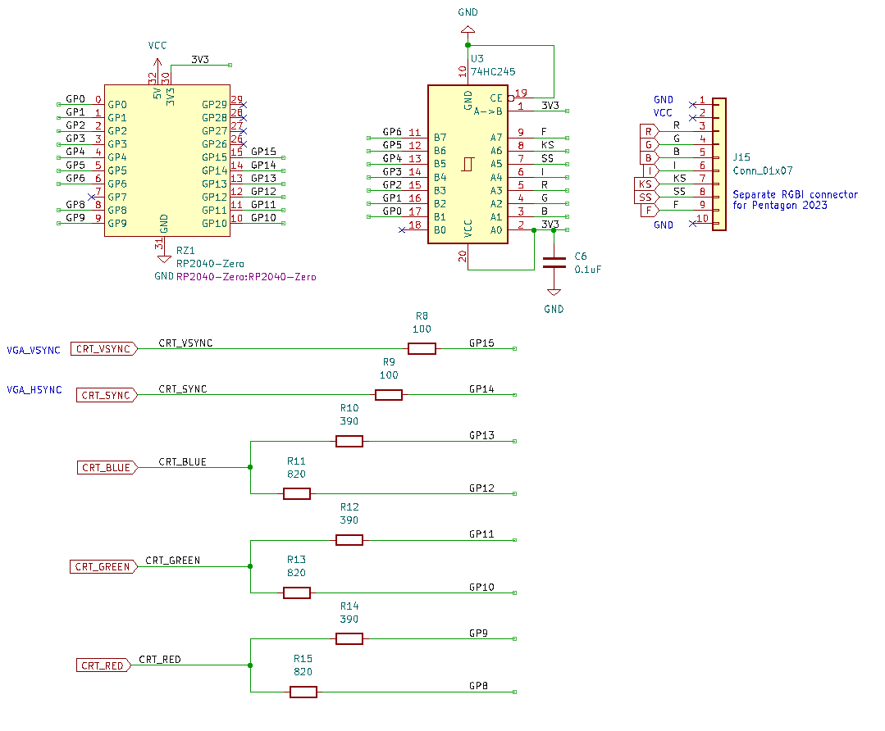

# Интерфейсная плата разъемов для Pentagon 128 2023/2024

Плата основывается на открытых проектах и информации:
* [PS/2 Universal Keyboard Controller (C) Xrust 2021](https://zx-pk.ru/threads/33211-universalnyj-kontroller-ps-2-klaviatury-dlya-kompyuterov-s-matrichnymi-klaviaturami.html)
* Схема согласования SCART TV-Out: Sprite @tg / Froggy @zx-pk.ru
* [ZX_RGBI2VGA-HDMI](https://github.com/AlexEkb4ever/ZX_RGBI2VGA-HDMI) (C) @Alex_Eburg 

## Входные требования:
Нужно разработать и изготовить плату интерфейсных разъемов для Pentagon 2023/2024. 
Плата подсоединяется слева к системному разъему.
* Выход на 15 KHz CRT TV/монитор с разъемом SCART RGB, звук на SCART не выводится.
* Контроллер PS/2 клавиатуры. Оставить возможность подсоединить внешнюю расширенную клавиатуру на матрице контактов.
* Вход для подключения Sega Mega Drive геймпада как Kempston.
* Разъем Floppy Power 5V.
* Разъем питания DC IN 5V (5.5x2.1mm) для подсоединения внешного блока питания без переходника.
* Разъем Audio Out стандартный stereo mini jack 3.5 mm.
* Разъем Tape In mono 3.5 mm.
* Разъем Tape Out mono 3.5 mm.
* Без МГТФ.

Недостающие на системном разъемы сигналы Audio Out и Kempston прокидываются стандартными шлейфами / кабелями.

Не входит в требования:
* Возможность размещения платы позади основной платы, а не слева. Тем не менее, это возможно, если запаять на основной и интерфейсной плате угловые разъемы "гребенкой" (pin header) и соединить их шлейфами.
* Выход на мониторы VGA 31 KHz, HDMI 720p
* Размещение beeper'а

## Детали реализации:
Для проектирования использовался KiCad 7. 
Размеры платы 150x60 мм.

### Выбор краевого разъема: 
Было желание использовать дешевые двухрядные 2.54 mm angle 2x32 pin header'ы. Увы, female разъемы на 2x32 pin в природе пока не обнаружены. 
Придется использовать DIN 41612. 
На известном китайском сайте комплект male+female 420 р. 

### TV Out:
В качестве разъема выхода на SCART использован трехрядный разъем DB15 в стандартной VGA распиновке. 
Это позволяет использовать стандартные кабели VGA-SCART или VGA-BNC, предназначенные для PC [СRTEmuDriver](http://geedorah.com/eiusdemmodi/forum/viewtopic.php?id=295) / присоединить к OSSC стандартным VGA кабелем / поэкспериментировать с некоторыми ЖК мониторами. 
Композитная синхронизация выведена на пин 13 (HSYNC). 
Опциональный раздельный вывод HSYNC/VSYNC рассматривался, но не реализован. 
На пин 9 (в VGA E-DDC +5V) выведено напряжение питания 5V через резистор 180 ом для удобства переключения TV в режим SCART RGB (SCART pin 16 Fast Switch). 
По стандарту SCART входное сопротивление на пинах RGBS 75 ом, размах сигналов RGB 0.7V, SYNC (Video In) 1V. На практике же может потребоваться подстройка уровня SYNC. 

На плате Pentagon заменены резисторы с 68 Ом: 
Резисторы на выход R,G,B: 680 Ом; 
Bright: 1.5 кОм - подбирается. 
Схему согласования и номиналы предоставил Sprite/Froggy. 

После некоторых сомнений заменены выходные резисторы 130 Ом сигналов RGB интерфейсной платы на подстроечные, т.к. не все телевизоры созданы одинаковыми. 

### Gamepad:
Подробнее по нюансам подключению Sega Mega Drive геймпада: 
https://t.me/Pentagon_ZX_Chat/122617

### PS/2 и обычная клавиатура:
[Контроллер клавиатуры PS/2 Universal Keyboard Controller (C) Xrust 2021](
https://zx-pk.ru/threads/33211-universalnyj-kontroller-ps-2-klaviatury-dlya-kompyuterov-s-matrichnymi-klaviaturami.html) 
Схема на мой взгляд идеологически верная, т.к. не использует wait и в принципе не зависит от скорости контроллера. 
Выбрана матрица ключей MT8816 в корпусе PLCC, т.к. она компактнее. Устанавливается в панельку для упрощения монтажа и демонтажа, если будет конфликт с матричной клавиатурой. 

На плате разведен разъем под подключение стандартной матричной клавиатуры. 
Отдаленном будущем планируется разработать плату расширенной клавиатуры на современных переключателях, с разъемом сигналов слева специально для Pentagon. 
Сейчас можно подключить например [клавиатуру от A.V.P.](https://github.com/AlexPodlesnov/ZX-Clone-Delta-C-mechanical-keyboard)

## Известные проблемы:
* При размещении дисковода (GOTEK) справа нужно тянуть кабель питания от интерфейсной платы длиной около 50 см.
* Доступные в продаже готовые кабели длиной до 30 см, очень редко 50 см. Было бы удобнее, если бы разъем питания дисковода остался на основной плате.
* Разъем Audio Out находится близко к разъему TV Out. Штекер наушников диаметром больше 8 мм - не поместится.
* Порядок рядов контактов a/b DIN 41612 отличается от СНП58. Также в дизайне платы пришлось перевернуть female разъем на нижнюю часть платы для корректной нумерации контактов. Размещаться он будет на верхней стороне платы.

## Сомнительно:
* На плате Pentagon 2024 выведено 5 пинов VCC, 6 пинов GND. На плате Pentagon 2023 выведено 2 пина VCC, 6 пинов GND. Не будет работать основная плата стабильно от питания через системный разъем - придется использовать Molex разъем питания.
* А не будут ли выходы ключей MT8816 в состоянии "0" конфликтовать с внешней клавиатурой?
* Нет блокировочного конденсатора на MT8816
* Для ATMEGA168 блокировочные конденсаторы желательны на каждый вход питания отдельно
* Электролитические конденсаторы большой емкости на питание убраны
* Mounting Holes без металлизации

## Bill of materials
На плате Pentagon заменены резисторы с 68 Ом: 
Резисторы на выход R,G,B: 680 Ом; 
Bright: 1.5 кОм - подбирается при необходимости.

U2 ATMEGA168PA-AU TQFP-32 
U1 MT8816AP PLCC-44 
PLCC-44 IC DIP socket

C1, C2 Capacitor_SMD:C_1206_3216Metric 0.1u

Q1, Q2, Q3, Q4 Транзистор К315Б x4

RV1 Bourns 3296W Potentiometer 1K Ohm 
[aliexpress](https://aliexpress.ru/item/32845414733.html?sku_id=65244516762) 
RV2, RV3, RV4 Bourns 3296W Potentiometer 500 Ohm 
[aliexpress](https://aliexpress.ru/item/32845414733.html?sku_id=65244516761)

R3 Resistor 0.25W R_Axial_DIN0207_L6.3mm_D2.5mm_P10.16mm 510R 
R4, R5, R6, R7 Resistor 0.25W R_Axial_DIN0207_L6.3mm_D2.5mm_P10.16mm 220R 
R2 Resistor 0.25W R_Axial_DIN0207_L6.3mm_D2.5mm_P10.16mm 180R

R1 Resistor_SMD:R_206_3216Metric 10K

### Разъемы:
J1 
Connector DIN 41612 Dual Row 64 Pin Male Female Pitch 2.54mm 2x32 
OUPIIN 9001-31641C00A (DIN 41612-64AB-MR) 
OUPIIN 9001-34641C00A (DIN 41612-64AB-FR) 
[aliexpress](https://aliexpress.com/item/4000215552439.html)

J4 Connector_IDC:IDC-Header_2x05_P2.54mm_Vertical 
[aliexpress](https://aliexpress.ru/item/1005004266492521.html?sku_id=12000028572172233)

J5 DSUB-9_Male_Horizontal_P2.77x2.84mm_EdgePinOffset7.70mm_Housed_MountingHolesOffset9.12mm 
[aliexpress](https://aliexpress.ru/item/32845329350.html?sku_id=12000028099335636) 
J6 DSUB-15-HD_Female_Horizontal_P2.29x1.98mm_EdgePinOffset3.03mm_Housed_MountingHolesOffset4.94mm 
[aliexpress](https://aliexpress.ru/item/32747020225.html?sku_id=61784388444)

J7 Floppy Power 4 Pin 2.54 mm Right Angle Connector 
[aliexpress](https://aliexpress.ru/item/1005006171641179.html?sku_id=12000036108671633) 
Подбирайте High / Flat вариант под вашу ревизию платы. Длина варианта High: 12 мм, Flat: 10 мм.

J9, J10, J11 
10PCS PJ-215 PJ-325 3.5MM Headphone jack 5Pin Female Socket Connector for Audio Video RED BLACK BLUE YELLOW GREEN
[aliexpress](https://aliexpress.com/item/32830267803.html) 

J12 Mini DIN 6 Female 
[aliexpress](https://aliexpress.ru/item/4000106967115.html?sku_id=10000000276404455)

J14 
PCB Mount 5.5 x 2.1 mm Female DC Power Connector 
[aliexpress](https://aliexpress.ru/item/32951864536.html)

## Сборка прошивки
В Arduino IDE: 
Открыть source/ATmega/Spectrum128.ino

Установить через Tools/Manage Libraries библиотеку [PS2KeyRaw](https://github.com/techpaul/PS2KeyRaw) 
Установить [MiniCore](https://github.com/MCUdude/MiniCore#how-to-install)

Выбрать Tools/Board/MiniCore/ATmega168 
Clock: Internal 8 MHz 
Variant: 168P / 168PA 

Sketch/Verify/Compile 
Sketch/Export compiled Binary

[Скомпилированная прошивка](source/ATmega/Spectrum128.ino_atmega168p_8000000L.hex)

## Заливка прошивки
При наличии совместимых программатора и bootloader'а в контроллере прошить можно прямо из Aduino IDE.

Также для прошивки ATmega можно использовать программатор CH341A и ПО NeoProgrammer V2.2.

[Fuses для прошивки ATmega168PA:](source/ATmega/fuses.png)
<pre>
Low     High    Extended
0xE2    0xDF    0x*F9
</pre>

## Замечания после сборки платы:
* После поключения к телевизору через SCART нет картинки. Нужно подстроить переменный резистор SYNC.
* Клавиатура PS/2 работает.
* Геймпад Sega Mega Drive работает как Kempston (нужен кабель FC 2x5 10pin 30 см.).
* Audio Out работает (нужен кабель, например от CDROM Audio 40-60 см.).
* Tape In работает (использовался кабель jack 3.5mm - jack 3.5mm и смартфон).
* В моем случае в новой ATmega168 были прошиты fuses на использование внешнего кварца, соответственно контроллер не работал и не прошивался. Решилось припайкой кварца на 8 MHz к ногам контроллера на время прошивки fuses.
* Размер прошивки позволяет использовать ATmega8A.

При подключении питания через разъем DC IN 5V (5.5x2.1mm) плата Пентагона работает стабильно, измеримого падения напряжения нет. Рекомендуемый блок питания MEAN WELL GST60A05-P1J 5V 6A 30W.

## Пока не проверялось:
После финализации платы на ней остался задел по свободному месту.

Для экспериментов добавлен интерфейс VGA на Raspberry Pi Pico по схеме @Alex_Eburg [ZX_RGBI2VGA-HDMI](https://github.com/AlexEkb4ever/ZX_RGBI2VGA-HDMI) 
Для полноразмерной зеленой платы Pico места нет, использовал RP2040-Zero от Waveshare. По отзывам автора оно как бы работает, но не стабильно. 
Есть некоторые проблемы с слабой внутренней подтяжкой RESET к VCC на плате RP2040-Zero.

Одновременно на плате может быть подключен либо CRT TV/SCART выход либо VGA.

На Pentagon 2024 сигналы RGBI для интерфейса выведены на системный разъем, для Pentagon 2023 можно прокинуть с разъема на плате коротким шлейфом.

### BoM:
RZ1 RP2040-Zero (Waveshare) 
U3 74HC245 TSSOP-20_4.4x6.5mm_P0.65mm

R8, R9 Resistor SMD 1206 100R x2 
R10, R12, R14 Resistor SMD 1206 390R x3 
R11, R13, R15 Resistor SMD 1206 820R x3

C6 Capacitor SMD 1206 0.1uF 